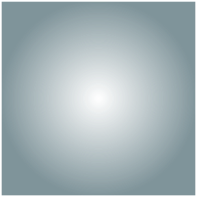
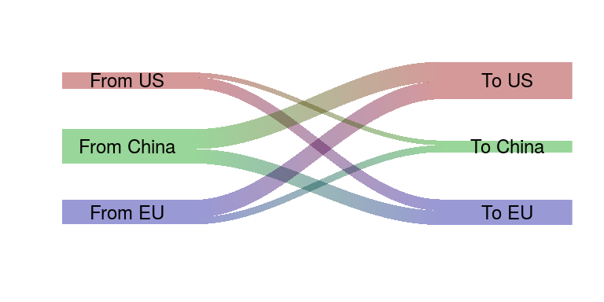

```{r setup, include=FALSE}
knitr::opts_chunk$set(echo = TRUE, warning = FALSE, message = FALSE)
```

## Nouvelles fonctionnalités dans les périphériques graphiques de R

Depuis R 4.1.0, les périphériques graphiques de R facilitent l'utilisation de gradients (linéaires, circulaires, avec des motifs), ainsi que du masquage (masking) et du rognage (clipping), et ce particulièrement à travers le package `grid`. Un compte rendu plus poussé est disponible [ici](https://www.stat.auckland.ac.nz/~paul/Reports/GraphicsEngine/definitions/definitions.html) et une présentation [ici](https://www.stat.auckland.ac.nz/~paul/Talks/useR2021/index.html)

On peut donc maintenant à l'aide de fonctions de `grid` comme `linearGradient` ou `radialGradient` produire des gradients :




## Intérêt des nouvelles fonctionnalités

Les nouvelles fonctionnalités permettent le développement de nouveaux types de graphiques qui peuvent maintenant se baser sur la grammaire de `grid`. Ça concerne des packages comme `riverplot` par exemple qui pourront mobiliser ces fonctionnalités, qui auparavant étaient bricolée à l'extérieure de `grid.`



Ces différents éléments (ainsi que l'ensemble des fonctionnalités de `grid`) peuvent par ailleurs être combinées avec les fonctionnalités de `ggplot` avec l'utilisation du package `gggrid`. Un rapport sur ce sujet est disponible [ici](https://www.stat.auckland.ac.nz/~paul/Reports/gggrid/gggrid.html). `gggrid` combiné avec les nouvelles fonctionnalités de gradients, clip et mask peut permettre la réalisation du graphique ci-dessous:


À noter que les nouvelles fonctionnalités (gradients, clip, mask) ne sont pas disponible pour tous les périphériques graphiques (graphic devices). Elles ne sont notamment pas disponible pour les périphériques standard de Windows et Mac : `windows()` et `quartz()`. `pdf()` devrait fonctionner correctement.

À terme l'intérêt doit être de pouvoir réaliser des graphiques complexes basés sur les fonctionnalités de `grid` comme par exemple la carte ci-dessous qui implique un clip complexe des lignes des niveaux par le contours des îles :


## Le package `sf` et son intégration dans `ggplot` avec `geom_sf`.

Ces différentes fonctionnalités et en particulier les clips complexes présentés avec la carte de la Nouvelle Zélande sont en fait déjà possible à réaliser avec des objets spatiaux et leurs opérations. Le package `sf` a remplacé récemment le package `sp` et propose des méthodes efficaces et compatibles avec le `tidyverse` pour gérer des objets spatiaux et réaliser des opérations d'intersection (clip) ou de mask (ou tout autre opération spatiale). Une introduction à `sf` et à la réalisation de graphiques spatiaux (y compris interactifs avec `leaflet`) est disponible [ici](https://statnmap.com/2018-07-14-introduction-to-mapping-with-sf-and-co/).
