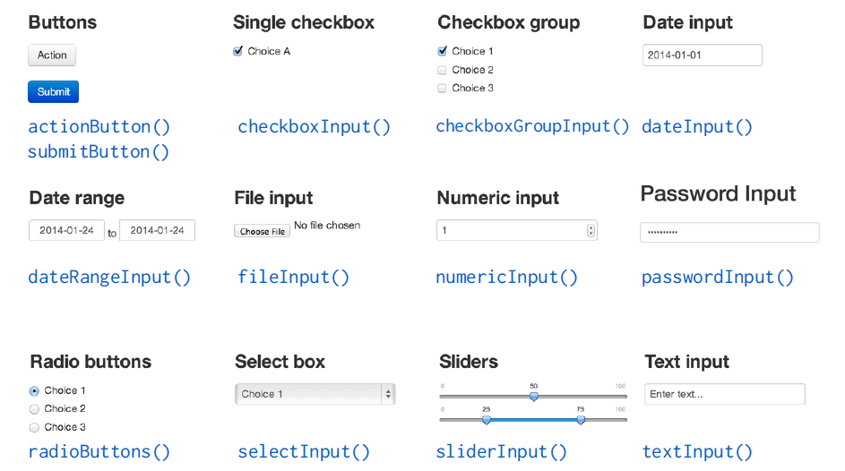

```{r setup, include=FALSE}
knitr::opts_chunk$set(echo = TRUE, eval = FALSE)
```

# Architecture basique de `shiny`

`shiny` permet de faire des applications interactives avec R.
Pour fonctionner, ces applications nécessitent une machine, le **serveur**, qui doit faire tourner R tout au long de leur utilisation.

Une application `shiny` s'écrit généralement sous la forme suivante :

- une partie *UI* (User Interface), appelée une unique fois par session, pour gérer l'affichage et l'interaction avec l'utilisateur,
- une partie *serveur*, appelée une fois par utilisateur, pour gérer les calculs R.
- une instruction `shinyApp()` pour lancer l'application.

```{r}
library(shiny)
ui <- fluidPage()

server <- function(input, output) {}

shinyApp(ui = ui, server = server)
```

## Partie *UI*

La partie *UI* récupère les inputs de l'utilisateur et affiche les outputs calculés par le serveur.

### Les inputs

Les inputs permettent de récupérer des instructions de l'utilisateur et sont généralement déclarés par des fonctions de la forme `****Input(inputId = "id", ...)` ou des clique-boutons comme `actionButton(inputId = "id", ...)`.
De façon non exhaustive :

{ align=center, width=80% }

### Les outputs

Les outputs déterminent des éléments de l'application dédiées à l'affichage d'éléments graphiques ou textuels et sont déclarés par des fonctions de la forme `****Output(outputId = "id", ...)`. Les plus utiles :

- `plotOutput(outputId = "id", ...)`
- `textOutput(outputId = "id", ...)`
- `dataTableOutput(outputId = "id", ...)`

## Partie *serveur*

Pour modifier les outputs et donc influer sur les éléments affichés dans l'application, il faut :

- créer les outputs via des assignations de type `output$id = ...`
- déclarer les méthodes de présentation qui seront employées au moment de la construction de l'application avec des functions de type `render****({ ... })` (`renderPlot`, `renderText`, `renderDataTable`, ...)
- accéder aux inputs avec `input$id`

```{r}
ui <- fluidPage( 
  sliderInput(inputId = "num",  
    label = "Choose a number",  
    value = 25, min = 1, max = 100), 
  plotOutput("hist") 
)

server <- function(input, output) {
  output$hist <- renderPlot({
    hist(rnorm(input$num))
  })
}
```

De cette façon, l'histogramme affiché par `ouput$hist` est automatiquement mis à jour lorsque l'utilisateur modifie le slider représenté par `input$num`. C'est ce qui est appelé la réactivité (plus généralement la notion d'observateur en programmation orientée objet, qui permet de construire des objets qui s'actualisent automatiquement lorsque d'autres objets changent).

## Structure fichier

Le code R doit être sauvegardé soit : dans un fichier nommé `app.R` ; soit dans deux fichiers, `ui.R` et `server.R`.

## Partager l'application 

Une application `shiny` peut être déposée sur <https://www.shinyapps.io/> pour pouvoir être accessible en ligne par tous.
La version gratuite du service permet de partager jusqu'à 5 applications, utilisables jusqu'à 25 heures par mois.
Un tutoriel pour publier les applications sur le site est disponible à l'adresse <https://shiny.rstudio.com/articles/shinyapps.html>.

# Notions plus avancées de réactivité

La fonction `server` n'est appelée qu'une unique fois au lancement de l'application.
Pour qu'une variable soit modifiée par l'utilisateur, elle doit donc être déclarée comme **réactive**.
Par exemple, comme vu précédemment, les variables d'output (spécifiées par `output$id`) doivent ensuite être encapsulées dans des méthodes du type `render****()`.
Cela a pour effet de rendre la variable `output$id` réactive : dès lors qu'une des variables d'input (spécifiées par `input$id`) qui intervient change, la variable d'output est mise à jour en conséquence.
Notons que, en l'absence d'une méthode `render****()`, le code suivant rendrait une erreur au moment du lancement de l'application :

```{r}
server <- function(input, output) { 
  output$hist <- hist(rnorm(input$num)) 
}
```

Il est également possible de définir des variables intermédiaires (ni output, ni input) réactives.

## `reactive({ ... })`

Cette fonction permet de rendre une expression réactive, i.e. qui sera mise à jour dès lors que des variables, de type input ou elles-mêmes réactives, et intervenant dans l'expression, seront modifiées.
A noter toutefois le fait qu'une variable définie ainsi se comporte comme une fonction : elle doit être appelée sans oublier les parenthèses.

```{r}
server <- function(input, output) { 
  x = rnorm(100)  # Lancé une unique fois lorsque l'application est démarrée
  mydata = reactive({ x[1:input$num] })
  output$hist <- renderPlot({ 
    hist( mydata() ) 
  })
}
```

##  `isolate({ ... })`

Cette fonction, qui s'utilise dans la définition d'une expression réactive, permet de casser la dépendance réactive d'une variable réactive.
Ainsi, dans le code suivant :

```{r}
server <- function(input, output) { 
  x = rnorm(100)  # Lancé une unique fois lorsque l'application est démarrée
  mydata = reactive({ x[1:input$num] })
  output$hist <- renderPlot({ 
    hist( mydata() , title = isolate({ input$title })) 
  })
}
```

le titre du graphique n'est pas mis à jour lorsque la variable `input$title` change.
Par contre, lorsque la variable `input$num` change, la variable réactive `mydata()` est mise à jour, ce qui entraine également la mise à jour d'`output$hist`.
Dans ce cas, la dernière valeur de `input$title` sera utilisée.

## `observeEvent(reactiveExpression, { ... })`

Cette commande permet d'exécuter du code dès lors que la variable `reactiveExpression`, et seulement celle-ci, est mise à jour.

```{r}
observeEvent(input$num, {
  print("New input detected!!")
  print(input$title)
})
```

La fonction `observe({ ... })` est similaire, mais à la différence de `observeEvent`, est exécutée dès lors que n'importe quelle expression réactive à l'intérieur de `{ ... }` est mise à jour.

## `eventReactive(reactiveExpression, { ... })`

Cette fonction est similaire à `observeEvent` mais retourne une expression réactive, mise à jour uniquement lorsque `reactiveExpression` change.
Cela permet donc de définir une variable réactive dépendante d'un déclencheur.

```{r}
server <- function(input, output) { 
  x = rnorm(100)  # Lancé une unique fois lorsque l'application est démarrée
  mydata = reactiveEvent(input$num, { x[1:length(input$title)] })
  output$hist <- renderPlot({ 
    hist( mydata() , title = isolate({ input$title })) 
  })
}
```

## `reactiveValues( ... )`

Cette fonction retourne une liste de valeurs réactives, qui peuvent ensuite être manipulées de façon dynamique.

```{r}
server <- function(input, output) { 
  mydata = reactiveValues(x = rnorm(100), y = NA)
  observe({
    mydata$y = mydata$x * input$num
  })
  output$hist <- renderPlot({ 
    hist( mydata() , title = isolate({ input$title })) 
  })
}
```

`reactiveVal(.)` se comporte similairement, mais ne contient qu'une seule valeur, et une variable `var = reactiveVal(0)` définie par cette méthode, se comporte alors comme une fonction get/set : elle doit être appelée avec les parenthèses `var()`, et est mise à jour avec la nouvelle valeur en argument `var(1)`.

# Notions avancées

## Récupérer la position d'un click sur un graphique

Il existe un moyen de récupérer la position d'un click de l'utilisateur sur un graphique, qui pourra ensuite être utilisé comme input dans le reste de l'application.
La fonction `ui` doit être modifiée pour rendre possible le suivi de la souris sur le graphique :

```{r}
ui = fluidPage(
  plotOutput(outputId = "plot", click = "click")
)
```

Désormais, la variable `input$click` contient les informations du click.
Par exemple, on peut accéder à la position du click via `input$click$x` et `input$click$y`.

```{r}
server = function(input, output) {
    myclicks = reactiveValues(x = 0, y = 0)
    observeEvent(input$click, {
        myclicks$x = c(myclicks$x, input$click$x)
        myclicks$y = c(myclicks$y, input$click$y)
    })
    output$plot = renderPlot({
        ggplot(data.frame(x = myclicks$x, y = myclicks$y)) +
            aes(x = x, y = y) + 
            geom_point() +
            coord_cartesian(xlim = c(-10, 10), ylim = c(-10, 10))
    })
}
```

## `conditionalPanel(condition, ...)`

Ce sont des éléments de la fonction `ui`, qui n'apparaissent que lorsque la `condition` est vérifiée. 
A noter que cette condition doit être codée en javascript (en particulier, les éléments d'une liste sont appelés avec le `.` plutôt que le `$`, par exemple `input.num`).

```{r}
ui = fluidPage(
  actionButton(inputId = "btn", "Clique-moi"),
  conditionalPanel("input.btn", actionButton(inputId = "btn1", "Clique-moi aussi")),
  conditionalPanel("input.btn1", actionButton(inputId = "btn2", "Félicitations"))
)
```

Par défaut, les variables accessibles dans la fonction `ui`, et donc sur lesquelles il est possible de conditionner le `conditionalPanel`, sont celles contenues dans les listes `input$...` et `output$...` déjà existantes.
Si l'on veut conditionner sur d'autres variables, potentiellement après des manipulations dans la fonction `server`, il est nécessaire de définir d'autres éléments de la liste `output`, puis de les rendre visibles à l'UI.
Par exemple, pour rendre visible un élément après un click :

```{r}
ui = fluidPage(
  "Clique sur (0,0)",
  plotOutput(outputId = "plot", click = "click"),
  conditionalPanel("output.showpanel", textOutput(outputId = "text"))
)

server = function(input, output) {
  output$plot = renderPlot({
        ggplot(data.frame(x = 0, y = 0)) +
            aes(x = x, y = y) + 
            geom_point() +
            coord_cartesian(xlim = c(-10, 10), ylim = c(-10, 10))
  })
  
  # Définit une variable réactive qui va prendre la valeur 1 dès lors que 
  # l'utilisateur aura cliqué sur l'origine du graphique
  hasclicked = reactiveVal(0)
  observeEvent(input$click, {
    if (sqrt(input$click$x^2 + input$click$y^2) < .1) {
      hasclicked(1)
    }
  })
  
  # Définit un élément de l'output, qui sera à terme visible dans l'ui
  output$showpanel = reactive({
    return(hasclicked())
  })
  outputOptions(output, "showpanel", suspendWhenHidden = FALSE) 
  # l'argument 'suspendWhenHidden = FALSE' permet de rendre visible cette
  # variable dans l'ui
  
  # Affiche un message de félicitations si l'utilisateur a cliqué sur l'origine
  output$text = renderText({
    "Bravo, tu as cliqué sur l'origine."
  })
}
```

## `renderUI`

La fonction `renderUI` permet d'adapter les objets UI avec des valeurs calculés dans la partie serveur. L'appel dans la partie UI se fait par la fonction spécifique `uiOutput()`. 
Dans ce cas là, les objets UI sont définis dans la partie serveur du code source et peuvent être dépendant d'une variable réactive ou d'un input. 

```{r}
ui <- fluidPage(
  uiOutput(outputId = "uiInput"), 
  textOutput(outputId = "text")
)

server <- function(input, output){
  x <- reactive(norm(100))
  output$uiInput <- renderUI({
    numericInput(inputId = "num", label = "choose a number", 
                 value = mean(x()))
  })
  output$text <- renderText({
    input$num 
  })
}
```

## Points à poursuivre 

- `req()` <https://shiny.rstudio.com/articles/req.html>
- module shiny <https://shiny.rstudio.com/articles/modules.html> et <https://www.ardata.fr/post/2019/02/11/why-using-modules/>
- mise en calcul en arrière plan avec **future** et **promises** <https://rstudio.github.io/promises/articles/shiny.html> 

# Références

- Une vidéo longue mais grandement informative : <https://vimeo.com/rstudioinc/review/131218530/212d8a5a7a/>
- Les diapositives associées sur le fonctionnement de `shiny` : <https://github.com/rstudio-education/shiny.rstudio.com-tutorial>