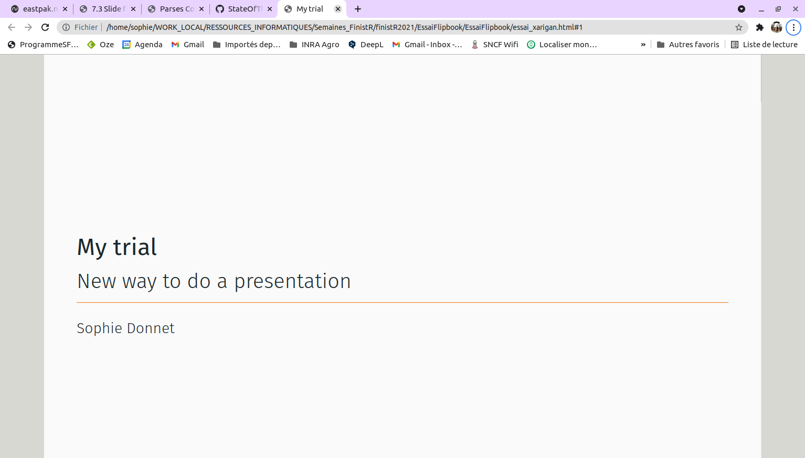

```{r setup, include=FALSE}
knitr::opts_chunk$set(echo = TRUE)
```


Nous avons travaillé à la fois sur Xarigan d'une part et d'autre part sur FlipbookR. 


[Xarigan](https://bookdown.org/yihui/rmarkdown/xaringan.html) est une extension de Rmarkdown qui permet de générer des présentations html d'un nouveau style. 

[FlipbookR](https://evamaerey.github.io/flipbookr/) est un outil permettant d'afficher côte à côte un code R et son résultat un fois exécuté, ce de façon séquentielle (commande par commande). C'est un outil utile pour les cours et les tutoriels.  

<br> 

## 1. A propos de Xarigan 
L'auteur revendique de l'avoir proposée car il ne supportait plus de voir beamer utilisé partout tout le temps. 
IL est basé sur remark.js mais en est une version pour les nuls. 

Il faut l'installer comme un package `install.packages(xarigan)`. 

Ensuite, on écrit sa présentation dans un fichier  classique `.Rmd` donc il faut en entête classique. 

````
---
title: "My trial"
subtitle: "New way to do presentation"
author: "Sophie Donnet"
output:
  xaringan::moon_reader:
    lib_dir: libs
    css: [default, metropolis, metropolis-fonts]
    nature:
      ratio: 16:9
      highlightStyle: github
      highlightLines: true
      countIncrementalSlides: false
---
```` 

Le style est défini dans `css:`. J'ai pris ici le style metropolis, qui est LE STYLE à la mode en ce moment (minimaliste, etc...). On peut aussi définir ses propres classes css (repartir d'un fichier déjà existant est conseillé.)


Chaque nouveau slide **commence avec 3 tirets (`---`) suivis directement d'un saut de ligne**. Si il y a des espaces avant ou après ça peut entraîner des erreurs. Ensuite le contenu des slides est très libres. 

Vous pouvez avoir des titres ou pas de titre, on des titres de diférents niveaux (`#`, `##`, etc...)

On peut définir au niveau des chaques slides des propriétés particulières. 
````
---

class: center, inverse
background-image: url("images/cool.png")

# A new slide

Content.
````


Les caractéristiques `inverse` sont définies dans le fichier `.css`. 


Pour utiliser son propre fichier `.css` (et non un style déjà défini), on peut y faire appel avec `moon_reader`:

---
output:
  xaringan::moon_reader:
    css: "my-style.css"
---
Le fichier `my-style.css` contient des instructions du genre : 

```` 
.inverse {
  background-color: #272822;
  color: #d6d6d6;
  text-shadow: 0 0 20px #333;
}
````

<center>
{width=50%}
</center>


# 2. Xariganthemer

Pour définir plus facilement son thème xarigan [`xariganthemer`](https://pkg.garrickadenbuie.com/xaringanthemer/) a été développé. 

Pour cela, il faut installer le package, y faire appel dans les instructions yml d'entête

````
output:
  xaringan::moon_reader:
    css: xaringan-themer.css
    
```` 
Il faut maintenant ajouter un chunk pour définir les font etc... 

```{r xaringan-themer, include=FALSE, warning=FALSE}
library(xaringanthemer)
style_mono_accent(
  base_color = "#1c5253",
  header_font_google = google_font("Josefin Sans"),
  text_font_google   = google_font("Montserrat", "300", "300i"),
  code_font_google   = google_font("Fira Mono")
)
```

On peut alors utiliser des font ou des couleurs institutionalles.  


